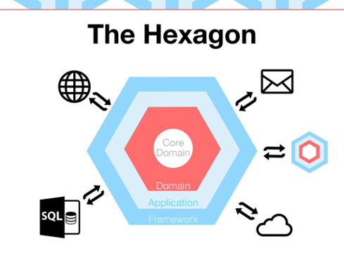

<h1 style="text-align: center;">
    Notifications Management System
</h1>

<div style="text-align: center;">

[](https://en.wikipedia.org/wiki/Hexagonal_architecture_(software))
[](https://www.docker.com/)

[](./LICENSE)

</div>

This project is a Golang-based application for notifications, utilizing a Hexagonal Architecture pattern for a clean separation of concerns and modular design.

## Project Structure

The application is organized around the main entity: `notification`. Each entity is encapsulated within three packages representing the layers of the Hexagonal Architecture:

- `infrastructure`: Contains code related to database operations, networking, and interfacing with external systems.
- `application`: Hosts the application logic, defining use cases and orchestrating between the infrastructure and domain layers.
- `domain`: Defines the business models and core business logic.

The following diagram illustrates the Hexagonal Architecture pattern:

- 

## Technologies Used

- **Programming Language:** GO 1.22
- **Build Tool:** Build

## How to Use

start container

```docker-compose
docker-compose up --build
```
